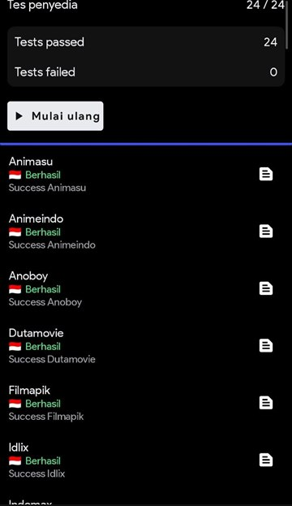

# IndoChannel

IndoChannel adalah repositori ekstensi komunitas untuk CloudStream yang menghadirkan katalog film, serial, dan anime dari berbagai provider berbahasa Indonesia melalui satu ekstensi, `IndoProvider`. Ekstensi ini tidak menyimpan atau meng-host video, melainkan memproses katalog dan tautan yang disediakan oleh situs sumber pihak ketiga.

## Provider

<table>
  <tr>
    <td valign="top">
      <table>
        <thead>
          <tr><th>Film &amp; Serial</th><th>Anime</th></tr>
        </thead>
        <tbody>
          <tr><td>Moviebox</td><td>Kuramanime</td></tr>
          <tr><td>Pencurimovie</td><td>Animasu</td></tr>
          <tr><td>Sarangfilm</td><td>Otakudesu</td></tr>
          <tr><td>Nomat</td><td>Samehadaku</td></tr>
          <tr><td>Kawanfilm</td><td>Anoboy</td></tr>
          <tr><td>LayarKaca (LK21)</td><td>Kuronime</td></tr>
          <tr><td>Ngefilm</td><td>Animeindo</td></tr>
          <tr><td>Dutamovie</td><td>Oploverz</td></tr>
          <tr><td>KitaNonton</td><td>Zoronime</td></tr>
          <tr><td>IndoXXI</td><td></td></tr>
          <tr><td>Filmapik</td><td></td></tr>
          <tr><td>IDLIX</td><td></td></tr>
          <tr><td>Pusatfilm</td><td></td></tr>
          <tr><td>keBioskop21</td><td></td></tr>
        </tbody>
      </table>
    </td>
    <td valign="top">
      
      <br>
      <sub>Hasil tes provider: 24/24 berhasil</sub>
    </td>
  </tr>
</table>

## Instalasi

[](https://self-similarity.github.io/http-protocol-redirector?r=cloudstreamrepo://raw.githubusercontent.com/ahmadbhaqi/IndoChannel/builds/repo.json)

Atau tambahkan repositori secara manual melalui **Settings → Extensions → Add Repository**, lalu masukkan URL berikut:

```
https://raw.githubusercontent.com/ahmadbhaqi/IndoChannel/builds/repo.json
```

Setelah repositori ditambahkan, buka **IndoChannel** dan instal ekstensi **IndoProvider**.

## Pengembangan

Membutuhkan **JDK 17** dan **Android SDK**.

```bash
./gradlew :IndoProvider:testDebugUnitTest   # unit test
./gradlew :IndoProvider:make                # build plugin
```

Pada Windows, gunakan `gradlew.bat` sebagai gantinya.

## Kontribusi

Issue dan pull request untuk perbaikan parser, provider, pemutaran, subtitle, pengujian, atau dokumentasi sangat diterima. Saat melaporkan masalah, sertakan nama provider, judul, episode, server yang dipilih, dan langkah reproduksi. Jangan menyertakan cookie, token, kredensial akun, atau data pribadi apa pun.
